# MWeb批量导入脚本

[TOC]

```
MWeb版本：3.3.3
```


## 1、问题场景

MWeb中并不能批量自动导入文档并且创建分类，默认的会导入目录下所有的放入当前的分类中

-   **脚本实现了下面的功能**
    -   批量创建分类
    -   批量导入文档，并自动的关联当前目录作为分类

**实现截图：**

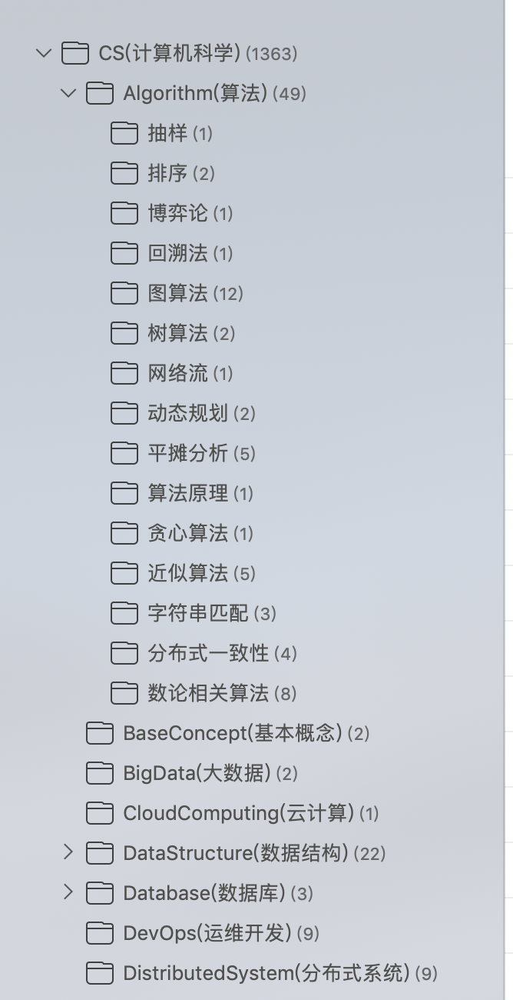

如上图所示，脚本识别到文件夹，自动创建分类，若是文件，则导入后关联对应的文件夹

## 2、使用方式

当前版本的脚本需要两个参数：

```
参数1： 待导入文件夹路径
参数2： MWeb文档库的位置
```

>   文件夹请使用绝对路径

```bash
bash batch_importer.sh [待导入文件夹路径] [MWeb文档库的位置]
```

如果遇到环境问题，[参考第5节](#env)


## 3、原理说明

MWeb文档之间的关系采用的本地数据库`sqlite3`来管理，首先看一下数据库中的表：

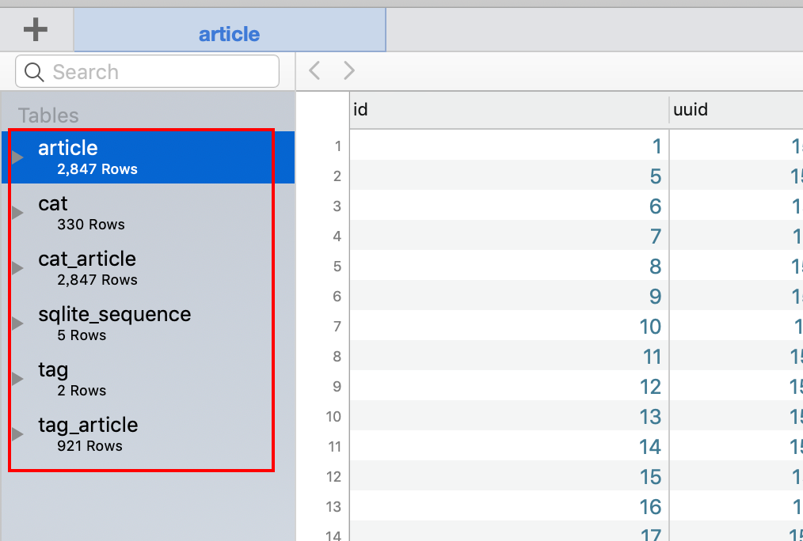

如山所示，一共有6张表，

| 表名            | 说明                                 |
| --------------- | ------------------------------------ |
| article         | 保存文章的基本信息                   |
| cat             | 保存分类的基本信息                   |
| cat_article     | 保存文章和分类之间的关系             |
| sqlite_sequence | 保存其他每个表使用的自增变量的当前值 |
| tag             | 保存tag的基本信息                    |
| tag_article     | 保存文章和tag之间的关系              |

### 3.1 article表

**表结构：**

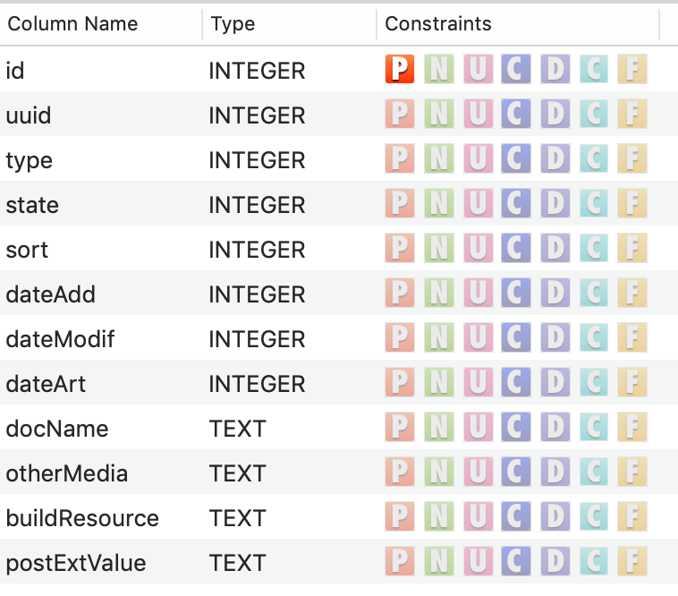

如上图所示，需要特别关注的就是`id`和`uuid`

-   id是主键，自增，这里的自增的基准放在`sqlite_sequence`表中
-   uuid是根据时间戳生成的，md文档的文件名就是这个时间戳，存放在`docs`目录中

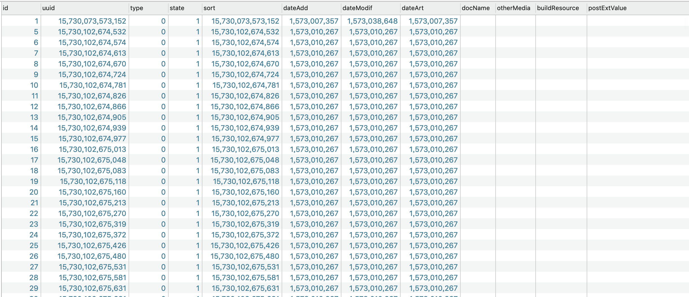

上面则是表中的数据

### 3.2 cat表

**表结构：**

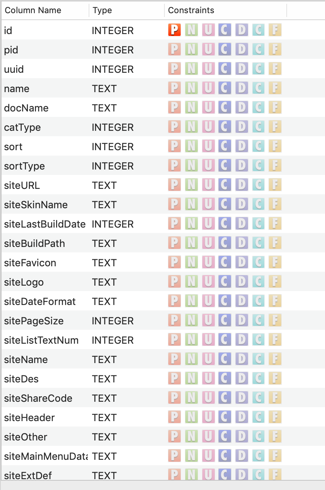

如上图所示，分类的表结构比较复杂，以`site`开头的是生成静态网站的一些属性，暂时不需要关注

主要关注`id`,`pid`,`uuid`,`name`

-   id是主键，自增的基准放在`sqlite_sequence`表中
-   pid是父级目录
-   uuid是根据时间戳生成的
-   name是分类名


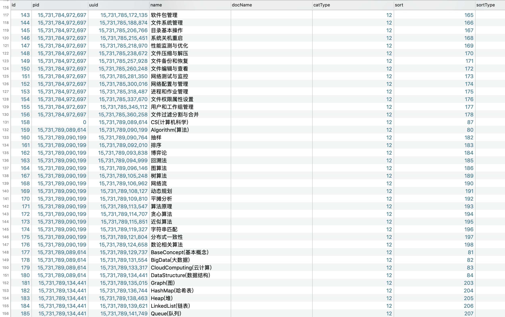

如上图是表中数据

### 3.3 cat_article表

表结构：


-   id 是主键，自增
-   rid是分类的uuid
-   aid是文章的uuid

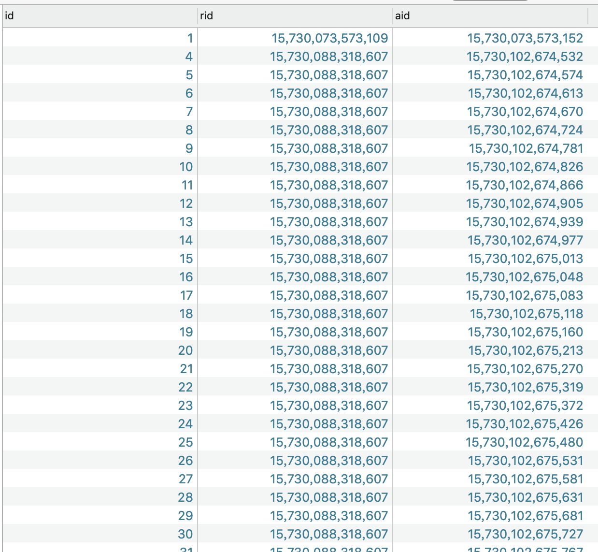

通过这个表，将分类和文章进行关联

### 3.4  sqlite_sequence表

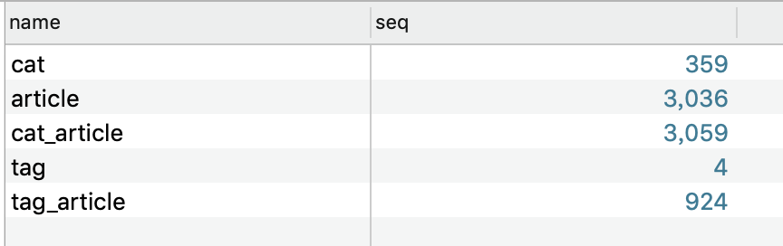

这个表记录的是其他的几个表的自增id的值，name对应的就是其他的表


### 3.5 tag表

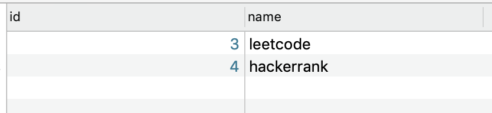

这个表比较简单，只有两个字段，id和tag名称


### 3.6 tag_article表

这个表保存的就是tag和文章的对应关系

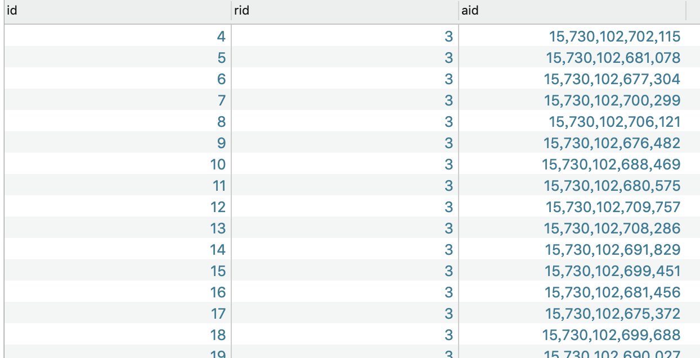


### 3.7 自动处理的基本流程

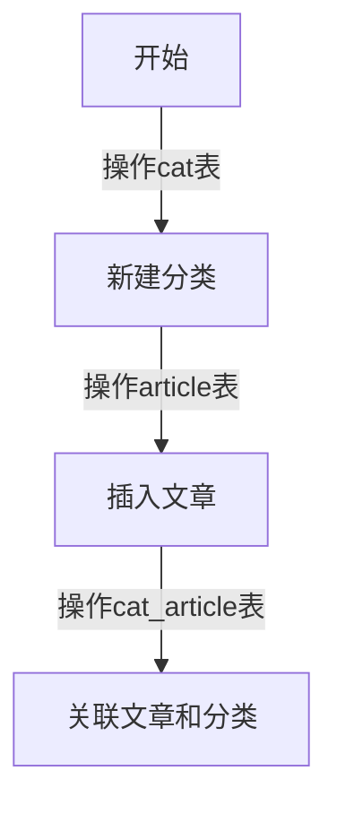

上面就简单的添加了新的文章，并关联的分类，新建分类的时候的id是从`sqlite_sequence`取出，并加一的，每次都需要更新这个表


## 4、工具

由于文本数量比较大，有一些文件名出现空格，手动修改不现实，下面的脚本能够将空格去除。

### 4.1 批量去除所有文件名中的空格

```bash
find [路径] -name "* *.md" -type f -print0 | while read -d $'\0' f; do mv -v "$f" "${f// /_}"; done
```


### 4.2 批量去除所有文件夹名中的空格

```bash
find [路径] -type d -name "* *" -print0 | sort -rz | while read -d $'\0' f; do mv -v "$f" "$(dirname "$f")/$(basename "${f// /_}")"; done
```


## 5、环境说明

<a name="env"></a>

脚本运行环境为Mac系统，由于系统默认的`date`命令无法得到微秒，这里安装`gun date`，采用下面的命令安装：

```bash
brew install coreutils
```

如果没有`brew`，使用下面的命令安装：

```bash
/usr/bin/ruby -e "$(curl -fsSL https://raw.githubusercontent.com/Homebrew/install/master/install)"
```


